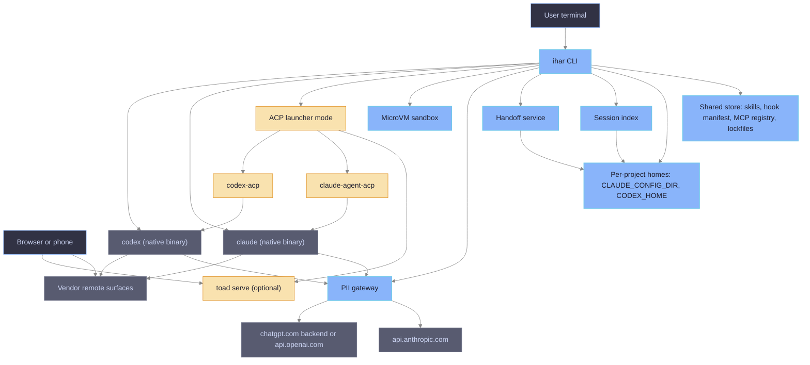
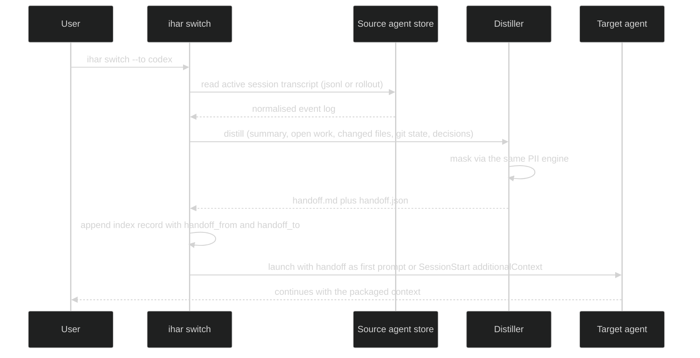

# ihar — Unified Agent Harness: High-Level Design

| Field | Value |
|-------|-------|
| Status | reviewed draft |
| Date | 2026-09-17 |
| Verified against | Claude Code 2.1.274, Codex CLI 0.154.0, claude-agent-acp 0.79.0, codex-acp @ 6ec22f3, Toad 0.6.20, ACP schema v1.22.0 |
| Based on | research page `ihar/concept/unified-harness-options` (options A–D) |
| Decision | Build Option A as the core; expose Option B as an optional ACP launcher mode of the same core |

## 1. Purpose and scope

`ihar` replaces the two wrappers `iclaude` (Claude Code) and `icodex` (Codex CLI) with one harness that owns the environment both agents run in: per-project config homes, shared skills, a shared hook layer, MCP registry, PII masking, microVM sandbox, a harness-neutral session index, a handoff protocol for switching agent or model mid-work, and one entry point for terminal and web use.

In scope: everything the two wrappers do today, plus the session index, handoff, and unified launch surface. Out of scope: reimplementing an agent loop, a custom chat UI, or any authentication path that is not the vendor's own binary or SDK.

This document re-evaluates Option A (native launcher) and Option B (ACP front end) after a second verification pass, records what was corrected, and fixes the target architecture.

## 2. Requirements

Functional requirements, each traceable to a section below.

| Id | Requirement | Met by |
|----|-------------|--------|
| R1 | Shared session history per project across both agents: one list, one resume entry point, links between related sessions | §6.5 session index, §6.6 handoff |
| R2 | Shared skills (SKILL.md) for both agents | §6.2 shared store |
| R3 | Shared hooks: one script set, one manifest, both agents enforce the same policies | §6.3 hook layer |
| R4 | PII and secret masking before any byte leaves the machine, for both agents | §6.4 PII gateway |
| R5 | MicroVM sandbox for both agents | §6.7 sandbox |
| R6 | One MCP registry rendered for both agents | §6.2 shared store |
| R7 | Terminal and web access to the same session | §6.8 web surfaces |
| R8 | Switch harness (Claude Code ⇄ Codex) or model to continue work | §6.6 handoff, native model flags |

Non-functional: keep vendor subscription auth inside vendor binaries (policy); fail-closed for security layers (an enabled gateway or sandbox that cannot start aborts the launch with a message, never runs unmasked); fail-soft for convenience layers (index, statusline, telemetry, handoff export warn and continue); no new session file format that vendors must read; Bash-first with Python helpers as in the existing wrappers.

## 3. Verified facts and constraints

Facts below were checked on 2026-09-17 against local binaries, local per-project homes, vendor documentation and adapter sources. Items marked UNVERIFIED rest on secondary sources.

### 3.1 Sessions

- Claude Code stores `projects/<mangled-cwd>/<uuid>.jsonl` (records `user`, `assistant`, `attachment`, `system`, `last-prompt`, `ai-title`, `permission-mode`, chained by `parentUuid`). Format declared internal and unversioned. Agent SDK `list_sessions()` returns `session_id, summary, last_modified, custom_title, first_prompt, git_branch, cwd, tag, created_at`. `claude agents --json` lists only live sessions.
- Codex stores `sessions/YYYY/MM/DD/rollout-*.jsonl` plus sqlite projections (`thread_history_1.sqlite`, `state_5.sqlite` table `threads` with `id, rollout_path, cwd, title, model_provider, git_branch, archived`). The app-server `thread/list` RPC returns `id, name, cwd, model, modelProvider, createdAt, updatedAt, gitInfo, preview`.
- Neither vendor accepts external history: Agent SDK resumes only its own jsonl; Codex `thread/start` has no initial items. Synthesizing a Claude transcript works today (proven by a bug repro and the Happy importer) but is a moving target; synthesizing a Codex rollout can desync the sqlite byte-offset projection.
- `claude import codex` exists in `--help` but exits 1 with "not yet available in this build" (2.1.274). Codex `/import` (from Claude Code or Cursor) exists in 0.154.0, imports config into `AGENTS.md`/`config.toml`, and is refused while connected to the local app-server daemon or in remote sessions. Codex feature flag `external_agent_memory_import` is "under development".

### 3.2 Proxying and auth

- Claude Code: `ANTHROPIC_BASE_URL` applies to OAuth (Pro/Max) sessions. Since 2.1.196 Remote Control is refused whenever the base URL is not `api.anthropic.com` (issue #72749 asks for a transparent-proxy exception). Anthropic consumer terms (Feb 2026) allow subscription OAuth only inside Claude Code and native Anthropic apps; the Agent SDK currently still draws on the subscription (planned separate credit pool paused).
- Codex: an explicit `model_providers.<id>.base_url` overrides the endpoint regardless of `auth_mode`, so ChatGPT OAuth traffic can be routed through a local proxy; `openai_base_url` seeds the built-in provider; `chatgpt_base_url` seeds workspace routing for ChatGPT-authenticated sessions (default `https://chatgpt.com/backend-api/`). `wire_api` must be `responses`. Hosted Remote Control dials out to a fixed relay `wss://chatgpt.com/backend-api/wham/remote/control/server` and needs the app-server daemon; `codex --remote ws://` is the direct LAN path with `--ws-auth capability-token|signed-bearer-token`. OpenAI publicly tolerates ChatGPT subscriptions in third-party harnesses; no terms text codifies it (UNVERIFIED as a contract).
- Today's `icodex` routes Codex through the PII proxy only on the API-key path (`openai_base_url` → `https://api.openai.com/v1`); subscription traffic bypasses masking. This is a defect to fix in `ihar`, not a vendor limit.

### 3.3 Hooks

- Same registration shape in Claude `settings.json` and Codex `hooks.json`: `hooks → <Event> → [{matcher, hooks:[{type:"command", command, timeout}]}]`. Codex `features` reports `hooks` stable. Codex discovers `$CODEX_HOME/hooks.json`, `config.toml [hooks]`, `<repo>/.codex/hooks.json`, plugin hooks; hook trust is persisted as `[hooks.state.*] trusted_hash` and `bypass_hook_trust = true` is already set in the template.
- Shared events: SessionStart, SessionEnd, UserPromptSubmit, PreToolUse, PostToolUse, PermissionRequest, PreCompact, PostCompact, SubagentStart, SubagentStop, Stop. Codex adds Interrupt; Claude adds around twenty more plus hook types `http`, `mcp_tool`, `prompt`, `agent`.
- Both support `hookSpecificOutput.updatedInput` and `additionalContext`; `SessionStart.source` enum is identical (`startup|resume|clear|compact|fork`).
- Differences a shared script must map: Codex `tool_name` is canonical `Bash`, `apply_patch`, `spawn_agent` (Claude-style `Write`/`Edit`/`Agent` accepted only as matcher aliases) while Claude delivers `Bash`, `Edit`, `Write`, `Read`, `Grep`, `mcp__*`; Codex adds `turn_id` and required `model`, Claude adds `prompt_id`, `scratchpad_dir`, `agent_id`; Codex output schema is `additionalProperties: false`. `permissionDecision` is `allow|deny|ask` on both (verified in the Claude binary strings and the Codex generated schema); exit code 2 blocks on both.
- Current wrapper scripts have diverged: block-secrets 354, redact-secrets 419, chain-gate 398 diff lines. The Codex redact script still says Codex lacks input rewriting; that is outdated, `updatedInput` is in the 0.154 schema.

### 3.4 Skills and MCP

- SKILL.md is the Agent Skills open standard; both agents read it. Discovery paths differ: Claude `$CLAUDE_CONFIG_DIR/skills`, `.claude/skills`, plugins; Codex `$CODEX_HOME/skills`, `.agents/skills`, plus `agents/openai.yaml` sidecar for Codex-only metadata. Seven skills already present in both stores, five only in iclaude.
- MCP: Claude `--mcp-config <json>` and `--strict-mcp-config`; Codex `config.toml [mcp_servers.<id>]` with `command|url`, `env`, `bearer_token_env_var`, OAuth via `codex mcp login`. Both take stdio and streamable HTTP.

### 3.5 ACP adapters (Option B inputs)

- `claude-agent-acp` runs the Agent SDK `query()`, resolves the CLI from `CLAUDE_CODE_EXECUTABLE` or a bundled platform package (not the PATH `claude`), honours `CLAUDE_CONFIG_DIR` and `ANTHROPIC_BASE_URL`, sets `settingSources: ["user","project","local"]`, implements `session/load` via SDK `resume`, `session/list`, fork, forwards client MCP servers, exposes permission modes including gated `bypassPermissions`, publishes slash commands and skills. Open issue #144: `settings.json` hooks do not fire under the adapter.
- `codex-acp` is TypeScript; it spawns the real `codex app-server` (npm `@openai/codex ^0.154.0`, or `CODEX_PATH`), honours `CODEX_HOME`, maps `session/load` to `thread/resume`, forwards approvals as ACP permission requests, supports API key and ChatGPT login through `account/*`. Open gaps: three fixed mode presets override `config.toml` sandbox and approval (#310, #477), no workspace-write plus network mode (#406), profiles unsupported (#229), skills list staleness (#320, #385).
- Toad 0.6.20: agents are packaged TOML, but `toad acp COMMAND [PATH]` runs an arbitrary command as an ACP agent; `toad serve` uses textual-serve on localhost:8000 with no authentication; resume calls `session/load` only when the agent advertises `loadSession`.
- Zed `agent_servers.<id> = {type:"custom", command, args, env}`. ACP v1.22 stabilised `session/list`; `session/new` carries `mcpServers` with `env` and `headers`.

## 4. Option A re-evaluated: native launcher

One wrapper, native TUIs, native web surfaces, harness-neutral index and handoff.

What the second pass changed:

- Confirmed: one PII gateway can front both agents on subscription auth (Codex `base_url` override is auth-mode independent).
- Corrected: the gateway in explicit mode disables Claude Remote Control. Option A therefore needs a transparent gateway mode (DNS or DNAT to a TLS-terminating proxy trusted through `NODE_EXTRA_CA_CERTS`, base URL untouched). The microVM path already uses DNAT to the host proxy, so the mechanism exists; the open risk is Remote Control bridge registration through a proxy (issue #71781, plaintext instead of CONNECT). Needs a spike before it is promised.
- Corrected: a single hook manifest works, but the renderer must emit vendor-specific matchers and the scripts need a ten-line normalisation shim (tool name, input field names, strict output keys). This is smaller than the drift the two script copies already carry.
- Corrected: `claude import` cannot be relied on; Codex `/import` can seed `AGENTS.md`/`config.toml` from a Claude project but not under the daemon. Handoff stays a first-prompt or SessionStart injection.
- Confirmed: Codex session listing must go through app-server `thread/list` (no CLI JSON). Reading `state_5.sqlite` directly is a fallback only.

Verdict: viable, lowest policy risk, all requirements met with R7 depending on the transparent gateway spike.

## 5. Option B re-evaluated: ACP front end

One ACP client (Toad, Zed, JetBrains, Neovim) over `claude-agent-acp` and `codex-acp`, wrapper as the command the client spawns.

What the second pass changed:

- Confirmed: env and config-home injection works through both adapters, MCP passthrough is spec-native, session load, list and fork exist for Claude, load for Codex, Toad and Zed accept a custom command.
- Corrected: hook parity is not guaranteed. Claude settings hooks are reported not firing under the adapter (#144 open). Codex hooks run inside the real app-server so they should apply, but codex-acp replaces sandbox and approval policy with its own presets, which breaks the run-mode contract `icodex` enforces today.
- Corrected: `claude-agent-acp` uses the Agent SDK and a bundled CLI binary, not the pinned isolated binary; the wrapper must set `CLAUDE_CODE_EXECUTABLE` to keep the lockfile pin. Subscription use through the Agent SDK is currently allowed but explicitly "under development" on Anthropic's side.
- Corrected: `toad serve` has no auth; web exposure needs a loopback bind plus SSH tunnel or a reverse proxy with auth in front. Claude Remote Control and Codex hosted Remote Control are not available inside an ACP client because the native TUI is not running.
- Confirmed: ACP does not carry a conversation across agents; the handoff layer of Option A is required unchanged.

Verdict: viable as a UI layer only after the hook and sandbox gaps close upstream or are compensated by the wrapper (hooks re-registered through SDK options cannot be done from outside the adapter; a fork of the adapter would be required). Not viable as the sole surface for security-relevant hooks today.

## 6. Target architecture

Option A core with an ACP launcher mode. Every box below is a Bash module or a small Python helper in the style of the existing wrappers.

### 6.1 ihar CLI

Single entry point `ihar [global flags] <command> [-- vendor args]`. Commands: `claude`, `codex` (launch), `sessions` (list, resume), `switch` (handoff to the other harness), `web` (start the vendor remote surface for the current session), `acp <agent>` (ACP launcher mode), `install`, `update`, `check`, `homes`. Everything after `--` is forwarded verbatim to the vendor binary. Vendor subcommands (`claude mcp …`, `codex mcp …`) are forwarded as `ihar claude -- mcp …` so the wrapper's own flags never shadow them (the current iclaude passthrough defect).

Phase order per launch: resolve project root and home id → populate home (marker, links, settings sync) under a flock → render hooks and MCP for the target vendor → start or attach gateway → start sandbox if requested → record launch in the session index → exec vendor binary with a sanitised environment.

### 6.2 Shared store and per-project homes

Keep the two-layer design both wrappers use: one shared store `.ihar-isolated/` (pinned `claude` in the isolated Node prefix, pinned static `codex`, `uv`, skills, hook scripts, hook manifest, MCP registry, plugin caches, auth files), and per-project homes `.ihar-homes/<basename>-<sha256(root)[:12]>/` holding `claude/` and `codex/` subdirectories that become `CLAUDE_CONFIG_DIR` and `CODEX_HOME`. Home id, `home.json` marker, GC, flock and integrity pinning carry over from iclaude S1–S8 unchanged; icodex gains them for free (its parity backlog TD1–TD5).

Skills: one `skills/` directory in the store, linked into `claude/skills` and `codex/skills`; project-local skills stay where each vendor looks (`.claude/skills`, `.agents/skills`), with `ihar check` warning when the two project dirs diverge. Codex-only metadata lives in `agents/openai.yaml` sidecars, ignored by Claude.

MCP: one registry `mcp/registry.json` (name, transport, command or url, env names, headers, scope). Renderers emit a Claude `--mcp-config` JSON and the Codex `[mcp_servers.*]` region inside `config.toml`. Secrets stay env-only. Managed regions in `config.toml` and managed keys in `settings.json` follow the iclaude S3 rule: machine-owned keys mirror the store on every launch, user keys are never touched.

### 6.3 Hook layer

One manifest `hooks/manifest.json`: event, logical tool set (`shell`, `file-write`, `file-read`, `mcp:<pattern>`, `skill`, `any`), script, timeout, vendors (`claude`, `codex`, `both`). Two renderers map logical sets to vendor matchers (`shell` → `Bash` for both; `file-write` → `Write|Edit|MultiEdit` for Claude and `apply_patch|Write|Edit` for Codex) and write the `hooks` block of `settings.json` and `hooks.json`.

Scripts read stdin through one shared module `hooks/_shared/hookio.py` that normalises `tool_name` (`apply_patch` → `Edit`), extracts the command or file fields (`command` vs `cmd`, `file_path` vs patch text), and emits the decision through a vendor-aware writer (`permissionDecision` `allow|deny|ask` on both, exit code 2 as the universal block, only schema-allowed keys for Codex). The redact hook uses `updatedInput` on both vendors. Claude-only hook types and events stay in a Claude-only section of the manifest. Codex hook trust: the renderer keeps `bypass_hook_trust = true` in the managed template because the store is the trusted source; the store lockfile pins the hook scripts by sha256 the same way it pins the binaries.

### 6.4 PII gateway

One Python proxy process per user (refcounted, as today) with two upstream routes: `/v1/messages` → `api.anthropic.com`, and `/backend-api/codex/responses` or `/v1/responses` → the Codex upstream selected by auth mode. Masking engines and levels are unchanged (Presidio with regex fallback, `off|secrets|standard`).

Two attachment modes:

- Explicit: `ANTHROPIC_BASE_URL=http://127.0.0.1:<port>` for Claude; for Codex `-c model_providers.ihar.base_url=… -c model_provider=ihar` with `requires_openai_auth = true` so ChatGPT OAuth keeps working (key present in the 0.154 binary; the interaction with `chatgpt_base_url` workspace routing is verified in S4). Costs Claude Remote Control.
- Transparent: hosts or DNAT redirect of `api.anthropic.com` and `chatgpt.com` to a TLS-terminating listener with a local CA trusted through `NODE_EXTRA_CA_CERTS` (Claude, Node) and `SSL_CERT_FILE` (Codex, Rust reqwest). Base URLs untouched, so Remote Control passes its host check. The listener masks only the model paths (`/v1/messages`, `/backend-api/codex/responses`, `/v1/responses`) and passes every other request, including the login flow and the Codex remote-control WebSocket relay on `chatgpt.com/backend-api/wham`, through unmodified. Same mechanism the microVM already uses at the guest boundary. Spike required: Remote Control bridge behaviour behind a transparent proxy (#71781) and WebSocket passthrough.

Langfuse capture and the CCR router chain remain optional add-ons on the Anthropic route only.

### 6.5 Session index

A per-project index `<home>/sessions.jsonl` (append-only, one record per launch or discovery) plus a reader that merges live vendor data. Record: `ihar_id, vendor, vendor_session_id, cwd, git_branch, title, model, started_at, updated_at, parent_ihar_id, handoff_from, handoff_to, tags`.

Sources: Claude via Agent SDK `list_sessions()` (or the `claude-code-log` style jsonl header read as fallback) and `claude agents --json` for live state; Codex via app-server `thread/list` on the local daemon socket (`$CODEX_HOME/app-server-control/app-server-control.sock`) with `state_5.sqlite` read-only as fallback when no daemon runs. `ihar sessions` prints one table; `ihar sessions resume <ihar_id>` dispatches to `claude --resume <id>` or `codex resume <id>` with the same home and gateway wiring as a fresh launch. Names are pushed to the vendor (`claude -n`, Codex `thread/metadata/update` or session name) so native pickers show the same title.

### 6.6 Handoff service

Mechanism for R8 across vendors. Not a transcript import; a bounded, sanitised context package.

Export: a reader per vendor turns the native transcript into one neutral event log (role, text, tool calls with names and paths, results truncated). Distill: a template-driven summary produced by the source agent itself on a fork of its own session (`claude -p --resume <id> --fork-session` or `codex exec fork <id>`, so the source transcript is never mutated; most faithful), or by a local rule-based extractor when the agent is unavailable. Output is masked with the PII engine before it is written. Inject: for Claude the package goes as the initial prompt argument, optionally with `--append-system-prompt`; for Codex as the initial `[PROMPT]` or via a SessionStart hook `additionalContext` that reads `<home>/handoff/latest.md` once and clears it. The package is bounded (target under 8 kB) and points at files rather than inlining them. Model switch inside a harness needs no handoff: native `--model`, `/model`, `--effort`, `-m`, `model_reasoning_effort`, profiles.

The same exporter feeds the wiki task ledger and the acdc-style git cross-check; existing tools (acdc, claude-mem, claude-code-log) are references, not dependencies.

### 6.7 Sandbox

The Firecracker microVM from iclaude becomes vendor-neutral: the shared image carries the isolated Node tree with `claude` and the static `codex` binary; guest init runs whichever the launch requests; the workspace, home and gateway DNAT rules are unchanged. Codex's own seatbelt or landlock sandbox and `ICODEX_MODE` presets stay as the inner layer and are still rendered into `config.toml`.

### 6.8 Web surfaces

Terminal and web on the same session (R7) use the vendor's own bridge, because both are the only paths that keep subscription auth and the native transcript:

- Claude: `ihar claude --web` starts the session with `--remote-control [name]`; requires OAuth login and the transparent gateway mode (or masking off).
- Codex: `ihar codex --web` ensures `codex app-server daemon` with remote control enabled under the project `CODEX_HOME`, pairs through `codex remote-control pair`, and starts the TUI attached to the daemon; `codex --remote ws://` remains for LAN access with token auth.
- Optional third-party hubs (Happy, Omnara, claude-code-ui) wrap the native binaries and can be pointed at `ihar claude` or `ihar codex` as the command; they are not part of the core.
- ACP web: `toad serve` bound to loopback behind an SSH tunnel, only in ACP launcher mode.

### 6.9 ACP launcher mode

`ihar acp claude` and `ihar acp codex` print nothing and exec the adapter with the same environment a native launch would get: `CLAUDE_CONFIG_DIR`, `CLAUDE_CODE_EXECUTABLE` (pinned binary), `ANTHROPIC_BASE_URL` or transparent gateway, `CODEX_HOME`, `CODEX_PATH`, rendered hooks and MCP. Toad (`toad acp "ihar acp claude"`) and Zed (`agent_servers` custom entry) consume it. The mode is marked experimental until claude-agent-acp #144 (hooks) and codex-acp #310/#477 (sandbox overrides) are resolved; `ihar check` reports both as known gaps.

## 7. Data contracts

Three small JSON contracts owned by ihar; vendors never read them.

- Hook manifest entry: `{event, tools, script, timeout, vendors, claude_only?: {type, extra}}`.
- MCP registry entry: `{name, transport: stdio|http, command?, args?, url?, env_names?, headers?, scope: user|project}`.
- Session index record and handoff package as in §6.5 and §6.6; `handoff.json` carries `source_vendor, source_session_id, target_vendor, created_at, git: {branch, head, dirty}, files_touched[], open_items[], masked: true`.

## 8. Security and privacy

- Auth boundary: Claude OAuth is used only by the `claude` binary or the Agent SDK inside `claude-agent-acp`; ihar never calls the Anthropic API itself. Codex auth stays in `auth.json` under the vendor process.
- Masking is a launch precondition when enabled: gateway health check failure aborts the launch instead of running unmasked.
- Hooks are the second layer (secret paths, secret content) and are rendered for both vendors from the trusted store; hook scripts are pinned by sha256 in the store lockfile, and Codex hook trust is bypassed only for those rendered entries.
- Handoff packages are masked and stored inside the per-project home, mode 600, never in the repository.
- Web: Claude Remote Control and Codex hosted relay are vendor-authenticated; `toad serve` and `codex --remote ws://` are bound to loopback or require token auth.
- Sandbox: microVM outer boundary, vendor sandbox inner boundary, destructive-command confirmation hooks unchanged.

## 9. Failure modes and limits

Named in advance, including the ones caused by using the design correctly.

- A switch is a summary, not a resume. Details not captured by the distiller are lost; the transcript stays in the source vendor's store and can be resumed there.
- Transparent gateway mode depends on a local CA and host redirection; a vendor pinning certificates or bypassing system trust breaks masking loudly (launch aborted), and Remote Control behind a proxy is unverified until the spike passes.
- Vendor session formats change without notice; the index reads official APIs first and treats file readers as best effort with a version guard.
- Hook parity covers the shared event subset only; Claude-only events and hook types do not run under Codex, and no hook is guaranteed under ACP mode today.
- Subscription policy on both sides can change abruptly; the design isolates that risk to the vendor binaries but cannot remove it.
- Codex `/import` and Claude `import` are vendor-controlled and unavailable in daemon or remote sessions; ihar does not depend on them.

## 10. Delivery plan

Ordered by risk and dependency; each slice has its own verification command in the style of the existing Bash test suites.

| Slice | Deliverable | Verification |
|-------|-------------|--------------|
| S1 | ihar CLI skeleton, shared store, per-project homes with both vendor subdirs, migration from `.claude-homes` and `.codex-homes` by copy | `tests/test_homes.sh`: home id, marker, links, settings and config managed regions for both vendors |
| S2 | Hook manifest, two renderers, `hookio.py` shim, scripts reunified | `tests/test_hooks.sh`: rendered blocks equal golden files; scripts pass fixtures in both vendor stdin shapes |
| S3 | MCP registry and renderers | `tests/test_mcp.sh`: both renders load in `claude mcp list` and `codex mcp list` |
| S4 | PII gateway with two upstream routes, explicit mode for both vendors including Codex OAuth | `tests/test_pii_gateway.sh`: masked bodies on both routes, launch abort on unhealthy gateway |
| S5 | Transparent gateway spike, Remote Control through it | manual protocol recorded on the task page; go or no-go for R7 on Claude |
| S6 | Session index and `ihar sessions` | `tests/test_sessions.sh`: index merges SDK, `thread/list` and fallbacks |
| S7 | Handoff export, distill, inject | `tests/test_handoff.sh`: package under size bound, masked, injected on both vendors |
| S8 | Web flags over native remote surfaces | manual protocol; Codex daemon under project home verified with `codex agents` |
| S9 | MicroVM image with both binaries | `tests/test_microvm.sh` extended with a Codex boot |
| S10 | ACP launcher mode, experimental | `tests/test_acp.sh`: env and paths reach the adapters; hook gap reported by `ihar check` |

Workflow route for implementation: chain (new module, public contracts in §7, security-relevant hook and gateway behaviour). Branch `dev-unified-harness` on this repository once the intent is approved.

## 11. Open questions

- Does Claude Remote Control register its bridge correctly behind a transparent TLS proxy after 2.1.196? Blocking for R7 with masking on Claude (S5).
- Will Anthropic keep Agent SDK use on subscriptions? Decides whether ACP mode can ever be the default surface.
- Should the distiller run on the source agent (faithful, costs tokens) or locally (free, coarser)? Default proposed: source agent when alive, local otherwise.
- Keep `icodex` run-mode presets as ihar flags, or fold them into a vendor-neutral `--mode` with a rendering table? Proposed: vendor-neutral `--mode read-only|workspace|full` rendered per vendor.

## 12. References

- Research page with options A–D and sources: `ihar/concept/unified-harness-options` (iwiki).
- Claude Code: docs on sessions, Agent SDK sessions, hooks, remote control, env vars, LLM gateway; issues #72749, #71781, #79196.
- Codex: `codex-rs/app-server/README.md`, `codex-rs/hooks/schema/generated/*`, `codex-rs/core/src/tools/hook_names.rs`, `codex-rs/model-provider/src/workspace_routing.rs`, `codex-rs/app-server-daemon/README.md`, config reference on learn.chatgpt.com.
- ACP: agentclientprotocol.com (session setup, session list), `agentclientprotocol/claude-agent-acp` (issue #144), `agentclientprotocol/codex-acp` (issues #310, #477, #406, #229, #320, #385), `batrachianai/toad`, Zed external agents docs.
- Existing wrappers: `iclaude/architecture/per-project-homes`, `iclaude/concept/pii-masking-proxy`, `iclaude/concept/microvm-sandbox`, `icodex/runtime-isolation`, `icodex/reference/techdebt-iclaude-parity-backlog` (iwiki).
