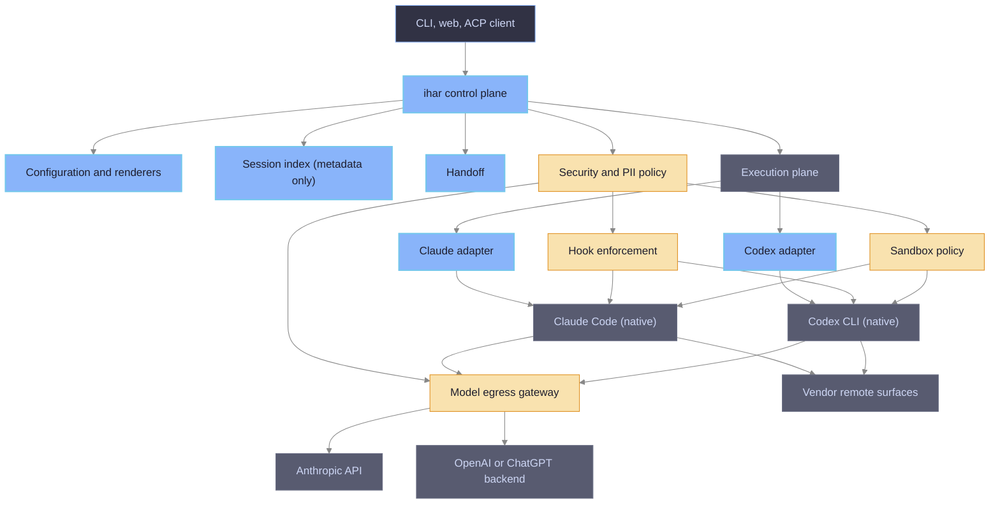
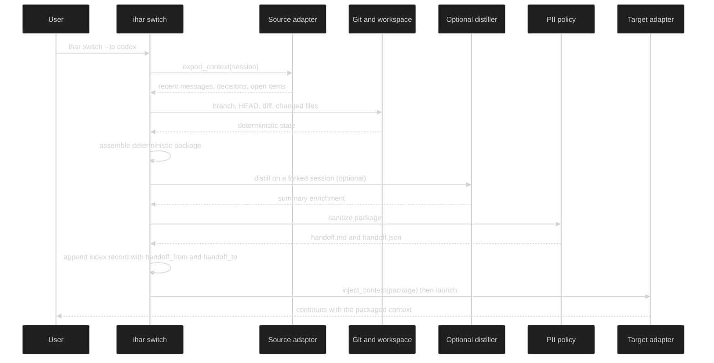

# ihar — Unified Agent Harness: High-Level Design

| Field | Value |
|-------|-------|
| Status | reviewed draft, revision 3 (`remote-protected` dropped after the transparent-gateway no-go) |
| Date | 2026-09-18 |
| Verified against | Claude Code 2.1.274, Codex CLI 0.154.0, claude-agent-acp 0.79.0, codex-acp @ 6ec22f3, Toad 0.6.20, ACP schema v1.22.0 |
| Based on | research page `ihar/concept/unified-harness-options` (options A–D) |
| Decision | Option A (native launcher) is the core; Option B (ACP) is an optional presentation layer of the same core |

## 1. Purpose and scope

`ihar` is a vendor-neutral control and security plane for launching native AI coding agents. It replaces the wrappers `iclaude` (Claude Code) and `icodex` (Codex CLI) with one harness that owns the environment both agents run in: per-project config homes, shared skills, a shared hook layer, MCP registry, PII policy, sandbox, a harness-neutral session index, a handoff protocol for switching agent or model mid-work, and one entry point for terminal, web and ACP use.

`ihar` is not a new agent, not a conversation runtime, not a transcript format, not a replacement for Claude Code or Codex, and not an authentication provider. Claude Code and Codex keep their own binaries, authentication, native session storage and execution semantics. The property this buys: adding a new agent requires a new adapter and renderers, not changes to security, sessions, handoff, MCP or project isolation.

In scope: everything the two wrappers do today, plus the session index, handoff, security profiles and unified launch surfaces. Out of scope: reimplementing an agent loop, a custom chat UI, or any authentication path that is not the vendor's own binary or SDK.

## 2. Requirements

Functional requirements, each traceable to a section below.

| Id | Requirement | Met by |
|----|-------------|--------|
| R1 | Shared session history per project across both agents: one list, one resume entry point, links between related sessions | §6.6 session index, §6.7 handoff |
| R2 | Shared skills (SKILL.md) for both agents | §6.3 shared store |
| R3 | Shared hooks: one script set, one manifest, both agents enforce the same policies | §6.4 renderers, §7 layer 2 |
| R4 | PII and secret protection for both agents, with a strict mode where no PII leaves the machine in a model request | §7 PII policy and enforcement |
| R5 | Sandbox for both agents, up to microVM | §7 layer 3 |
| R6 | One MCP registry rendered for both agents | §6.3, §6.4 |
| R7 | Terminal and web access to the same session | §6.8 web surfaces, §8 profiles |
| R8 | Switch harness (Claude Code ⇄ Codex) or model to continue work | §6.7 handoff, adapter `switch_model` |

Non-functional: keep vendor subscription auth inside vendor binaries (policy); fail-closed for security layers (an enabled gateway or sandbox that cannot start aborts the launch with a message, never runs unprotected); fail-soft for convenience layers (index, statusline, telemetry, handoff export warn and continue); no new session file format that vendors must read; Bash-first with Python helpers as in the existing wrappers.

## 3. Verified facts and constraints

Facts below were checked on 2026-09-17 against local binaries, local per-project homes, vendor documentation and adapter sources. Items marked UNVERIFIED rest on secondary sources.

### 3.1 Sessions

- Claude Code stores `projects/<mangled-cwd>/<uuid>.jsonl` (records `user`, `assistant`, `attachment`, `system`, `last-prompt`, `ai-title`, `permission-mode`, chained by `parentUuid`). Format declared internal and unversioned. Agent SDK `list_sessions()` returns `session_id, summary, last_modified, custom_title, first_prompt, git_branch, cwd, tag, created_at`. `claude agents --json` lists only live sessions.
- Codex stores `sessions/YYYY/MM/DD/rollout-*.jsonl` plus sqlite projections (`thread_history_1.sqlite`, `state_5.sqlite` table `threads` with `id, rollout_path, cwd, title, model_provider, git_branch, archived`). The app-server `thread/list` RPC returns `id, name, cwd, model, modelProvider, createdAt, updatedAt, gitInfo, preview`.
- Neither vendor accepts external history: Agent SDK resumes only its own jsonl; Codex `thread/start` has no initial items. Synthesizing a Claude transcript works today (proven by a bug repro and the Happy importer) but is a moving target; synthesizing a Codex rollout can desync the sqlite byte-offset projection.
- `claude import codex` exists in `--help` but exits 1 with "not yet available in this build" (2.1.274). Codex `/import` (from Claude Code or Cursor) exists in 0.154.0, imports config into `AGENTS.md`/`config.toml`, and is refused while connected to the local app-server daemon or in remote sessions. Codex feature flag `external_agent_memory_import` is "under development".

### 3.2 Proxying and auth

- Claude Code: `ANTHROPIC_BASE_URL` applies to OAuth (Pro/Max) sessions. Since 2.1.196 Remote Control is refused whenever the base URL is not `api.anthropic.com` (issue #72749 asks for a transparent-proxy exception). Anthropic consumer terms (Feb 2026) allow subscription OAuth only inside Claude Code and native Anthropic apps; the Agent SDK currently still draws on the subscription (planned separate credit pool paused).
- Codex: an explicit `model_providers.<id>.base_url` overrides the endpoint regardless of `auth_mode`, so ChatGPT OAuth traffic can be routed through a local proxy; `openai_base_url` seeds the built-in provider; `chatgpt_base_url` seeds workspace routing for ChatGPT-authenticated sessions (default `https://chatgpt.com/backend-api/`). `wire_api` must be `responses`. Hosted Remote Control dials out to a fixed relay `wss://chatgpt.com/backend-api/wham/remote/control/server` independent of the model base URL and needs the app-server daemon; `codex --remote ws://` is the direct LAN path with `--ws-auth capability-token|signed-bearer-token`. OpenAI publicly tolerates ChatGPT subscriptions in third-party harnesses; no terms text codifies it (UNVERIFIED as a contract).
- Today's `icodex` routes Codex through the PII proxy only on the API-key path (`openai_base_url` → `https://api.openai.com/v1`); subscription traffic bypasses masking. This is a defect to fix in `ihar`, not a vendor limit.

### 3.3 Hooks

- Same registration shape in Claude `settings.json` and Codex `hooks.json`: `hooks → <Event> → [{matcher, hooks:[{type:"command", command, timeout}]}]`. Codex `features` reports `hooks` stable. Codex discovers `$CODEX_HOME/hooks.json`, `config.toml [hooks]`, `<repo>/.codex/hooks.json`, plugin hooks; hook trust is persisted as `[hooks.state.*] trusted_hash` and `bypass_hook_trust = true` is already set in the template.
- Shared events: SessionStart, SessionEnd, UserPromptSubmit, PreToolUse, PostToolUse, PermissionRequest, PreCompact, PostCompact, SubagentStart, SubagentStop, Stop. Codex adds Interrupt; Claude adds around twenty more plus hook types `http`, `mcp_tool`, `prompt`, `agent`.
- Both support `hookSpecificOutput.updatedInput` and `additionalContext`; `SessionStart.source` enum is identical (`startup|resume|clear|compact|fork`); both match `mcp__<server>__<tool>` tool names in PreToolUse.
- Differences a shared script must map: Codex `tool_name` is canonical `Bash`, `apply_patch`, `spawn_agent` (Claude-style `Write`/`Edit`/`Agent` accepted only as matcher aliases) while Claude delivers `Bash`, `Edit`, `Write`, `Read`, `Grep`, `mcp__*`; Codex adds `turn_id` and required `model`, Claude adds `prompt_id`, `scratchpad_dir`, `agent_id`; Codex output schema is `additionalProperties: false`. `permissionDecision` is `allow|deny|ask` on both (verified in the Claude binary strings and the Codex generated schema); exit code 2 blocks on both.
- Current wrapper scripts have diverged: block-secrets 354, redact-secrets 419, chain-gate 398 diff lines. The Codex redact script still says Codex lacks input rewriting; that is outdated, `updatedInput` is in the 0.154 schema.

### 3.4 Skills and MCP

- SKILL.md is the Agent Skills open standard; both agents read it. Discovery paths differ: Claude `$CLAUDE_CONFIG_DIR/skills`, `.claude/skills`, plugins; Codex `$CODEX_HOME/skills`, `.agents/skills`, plus `agents/openai.yaml` sidecar for Codex-only metadata. Seven skills already present in both stores, five only in iclaude.
- MCP: Claude `--mcp-config <json>` and `--strict-mcp-config`; Codex `config.toml [mcp_servers.<id>]` with `command|url`, `env`, `bearer_token_env_var`, OAuth via `codex mcp login`. Both take stdio and streamable HTTP. MCP traffic goes from the agent process to the server directly; `ihar` sees it only through the registry and through PreToolUse hooks on `mcp__*` tools.

### 3.5 ACP adapters (Option B inputs)

- `claude-agent-acp` runs the Agent SDK `query()`, resolves the CLI from `CLAUDE_CODE_EXECUTABLE` or a bundled platform package (not the PATH `claude`), honours `CLAUDE_CONFIG_DIR` and `ANTHROPIC_BASE_URL`, sets `settingSources: ["user","project","local"]`, implements `session/load` via SDK `resume`, `session/list`, fork, forwards client MCP servers, exposes permission modes including gated `bypassPermissions`, publishes slash commands and skills. Open issue #144: `settings.json` hooks do not fire under the adapter.
- `codex-acp` is TypeScript; it spawns the real `codex app-server` (npm `@openai/codex ^0.154.0`, or `CODEX_PATH`), honours `CODEX_HOME`, maps `session/load` to `thread/resume`, forwards approvals as ACP permission requests, supports API key and ChatGPT login through `account/*`. Open gaps: three fixed mode presets override `config.toml` sandbox and approval (#310, #477), no workspace-write plus network mode (#406), profiles unsupported (#229), skills list staleness (#320, #385).
- Toad 0.6.20: agents are packaged TOML, but `toad acp COMMAND [PATH]` runs an arbitrary command as an ACP agent; `toad serve` uses textual-serve on localhost:8000 with no authentication; resume calls `session/load` only when the agent advertises `loadSession`.
- Zed `agent_servers.<id> = {type:"custom", command, args, env}`. ACP v1.22 stabilised `session/list`; `session/new` carries `mcpServers` with `env` and `headers`.

## 4. Option A re-evaluated: native launcher

One wrapper, native TUIs, native web surfaces, harness-neutral index and handoff.

What the second pass changed:

- Confirmed: one model egress gateway can front both agents on subscription auth (Codex `base_url` override is auth-mode independent).
- Corrected: the gateway in explicit mode disables Claude Remote Control. The proposed transparent alternative required an undefined privileged redirect boundary and was dropped after the S5b/S11 spike (§8). Claude Remote Control with masking is therefore not offered.
- Corrected: a single hook manifest works, but the renderer must emit vendor-specific matchers and the scripts need a ten-line normalisation shim (tool name, input field names, strict output keys). This is smaller than the drift the two script copies already carry.
- Corrected: `claude import` cannot be relied on; Codex `/import` can seed `AGENTS.md`/`config.toml` from a Claude project but not under the daemon. Handoff stays a first-prompt or SessionStart injection.
- Confirmed: Codex session listing must go through app-server `thread/list` (no CLI JSON). Reading `state_5.sqlite` directly is a fallback only.

Verdict: viable for the shipped profiles. R7 with masking on Claude Remote Control was the isolated exception and was explicitly dropped after the transparent spike failed.

## 5. Option B re-evaluated: ACP front end

One ACP client (Toad, Zed, JetBrains, Neovim) over `claude-agent-acp` and `codex-acp`, wrapper as the command the client spawns.

What the second pass changed:

- Confirmed: env and config-home injection works through both adapters, MCP passthrough is spec-native, session load, list and fork exist for Claude, load for Codex, Toad and Zed accept a custom command.
- Corrected: hook parity is not guaranteed. Claude settings hooks are reported not firing under the adapter (#144 open). Codex hooks run inside the real app-server so they should apply, but codex-acp replaces sandbox and approval policy with its own presets, which breaks the run-mode contract `icodex` enforces today.
- Corrected: `claude-agent-acp` uses the Agent SDK and a bundled CLI binary, not the pinned isolated binary; the wrapper must set `CLAUDE_CODE_EXECUTABLE` to keep the lockfile pin. Subscription use through the Agent SDK is currently allowed but explicitly "under development" on Anthropic's side.
- Corrected: `toad serve` has no auth; web exposure needs a loopback bind plus SSH tunnel or a reverse proxy with auth in front. Claude Remote Control and Codex hosted Remote Control are not available inside an ACP client because the native TUI is not running.
- Confirmed: ACP does not carry a conversation across agents; the handoff layer of Option A is required unchanged.

Verdict: an optional, experimental presentation layer on top of the Option A core; not an execution foundation. Not viable as the sole surface for security-relevant hooks until the upstream gaps close or the adapters are forked.

## 6. Target architecture

Two logical planes. The control plane orchestrates and decides; the execution plane is where native agents, hooks, sandbox, MCP servers and model egress actually run. Security policy is defined in the control plane and enforced in the execution plane.



### 6.1 Control plane

Responsibilities: the `ihar` CLI, project root and home resolution, configuration and renderers, security profile selection, session index, handoff, agent adapters, launch lifecycle. It never handles a model payload and never holds vendor credentials.

Single entry point `ihar [global flags] <command> [-- vendor args]`. Commands: `claude`, `codex` (launch), `sessions` (list, resume), `switch` (handoff to the other harness), `web` (start the vendor remote surface for the current session), `acp <agent>` (ACP launcher mode), `install`, `update`, `check`, `homes`. Everything after `--` is forwarded verbatim to the vendor binary. Vendor subcommands (`claude mcp …`, `codex mcp …`) are forwarded as `ihar claude -- mcp …` so the wrapper's own flags never shadow them (the current iclaude passthrough defect).

Launch lifecycle: resolve project root and home id → select security profile → populate home (marker, links, settings sync) under a flock → render hooks, MCP and config for the target vendor → start or attach the enforcement points the profile requires (gateway, sandbox) and abort on failure → record launch in the session index → adapter `launch()` execs the vendor binary with a sanitised environment.

### 6.2 Execution plane

Responsibilities: the native agent processes, their hooks, the sandbox boundary, MCP server processes, model network egress, and the vendor remote-control mechanisms. Everything here runs vendor code or policy code that vendor code invokes; `ihar` places it and configures it but does not sit inside the agent loop.

### 6.3 Shared store and per-project homes

Keep the two-layer design both wrappers use: one shared store `.ihar-isolated/` (pinned `claude` in the isolated Node prefix, pinned static `codex`, `uv`, skills, hook scripts, hook manifest, MCP registry, plugin caches, auth files), and per-project homes `.ihar-homes/<basename>-<sha256(root)[:12]>/` holding `claude/` and `codex/` subdirectories that become `CLAUDE_CONFIG_DIR` and `CODEX_HOME`. Home id, `home.json` marker, GC, flock and integrity pinning carry over from iclaude S1–S8 unchanged; icodex gains them for free (its parity backlog TD1–TD5).

Skills: one `skills/` directory in the store, linked into `claude/skills` and `codex/skills`; project-local skills stay where each vendor looks (`.claude/skills`, `.agents/skills`), with `ihar check` warning when the two project dirs diverge. Codex-only metadata lives in `agents/openai.yaml` sidecars, ignored by Claude.

MCP: one registry `mcp/registry.json` (name, transport, command or url, env names, headers, scope, allowed profiles). Secrets stay env-only. Managed regions in `config.toml` and managed keys in `settings.json` follow the iclaude S3 rule: machine-owned keys mirror the store on every launch, user keys are never touched.

### 6.4 Agent adapters and renderers

Vendor-specific behaviour lives in exactly two places: one adapter per agent and one renderer per configuration kind. Adapters translate canonical `ihar` operations into vendor commands and APIs; they implement no security policy. Renderers translate canonical configuration into vendor files.

Adapter contract (`lib/adapters/<vendor>.sh`, one function per operation, same names for every vendor):

```text
AgentAdapter
    capabilities()      -> flags: remote_control, fork, session_list_api, hook_events, sandbox_modes
    launch(home, profile, args)
    resume(home, vendor_session_id, args)
    list_sessions(home) -> canonical records (vendor session id, cwd, title, model, timestamps, branch)
    get_session(home, vendor_session_id) -> normalised event log for export
    export_context(home, vendor_session_id) -> deterministic context (files, decisions, recent messages)
    switch_model(model, effort)
    start_remote(home, vendor_session_id, mode)
    inject_context(home, package) -> first prompt or SessionStart context
```

Implementations: `ClaudeAdapter` (Agent SDK `list_sessions`, `claude --resume`, `--fork-session`, `--remote-control`, `-n`), `CodexAdapter` (app-server `thread/list`, `thread/metadata/update`, `codex resume`, `codex exec fork`, `remote-control`, `--remote`). Later adapters (Gemini CLI, a local agent) add a file each and reuse everything else.

Renderers (`lib/render/`):

```text
HookRenderer    manifest.json  -> settings.json hooks block | hooks.json
McpRenderer     registry.json  -> --mcp-config JSON        | config.toml [mcp_servers.*]
ConfigRenderer  profile + home -> settings.json managed keys | config.toml managed regions
```

Hook manifest entries carry a logical tool set (`shell`, `file-write`, `file-read`, `mcp:<pattern>`, `skill`, `any`); `HookRenderer` maps it to vendor matchers (`shell` → `Bash` for both; `file-write` → `Write|Edit|MultiEdit` for Claude and `apply_patch|Write|Edit` for Codex). Scripts read stdin through one shared module `hooks/_shared/hookio.py` that normalises `tool_name` (`apply_patch` → `Edit`), extracts the command or file fields (`command` vs `cmd`, `file_path` vs patch text), and emits decisions through a vendor-aware writer (`permissionDecision` `allow|deny|ask` on both, exit code 2 as the universal block, only schema-allowed keys for Codex). Claude-only hook types and events stay in a Claude-only section of the manifest. Codex hook trust: the renderer keeps `bypass_hook_trust = true` in the managed template because the store is the trusted source; the store lockfile pins the hook scripts by sha256 the same way it pins the binaries.

### 6.5 Model egress gateway

One Python proxy process per user (refcounted, as today) handles model inference traffic only: `/v1/messages` → `api.anthropic.com`, and `/backend-api/codex/responses` or `/v1/responses` → the Codex upstream selected by auth mode. Auth, update, login and remote-control traffic are never proxied. Masking engines and levels are unchanged (Presidio with regex fallback, `off|secrets|standard`).

One attachment mode ships: `ANTHROPIC_BASE_URL=http://127.0.0.1:<port>` for Claude; for Codex `-c model_providers.ihar.base_url=… -c model_provider=ihar` with `requires_openai_auth = true` so ChatGPT OAuth keeps working. It costs Claude Remote Control; Codex remote control is unaffected. The transparent alternative was rejected by the measured S5b/S11 spike because installing its scoped redirect requires a privileged component this design does not define.

Langfuse capture and the CCR router chain remain optional add-ons on the Anthropic route only.

### 6.6 Session index

A metadata index, never a conversation store. `ihar` does not own transcripts; native content stays in the Claude and Codex stores and is read through the adapters on demand.

Per-project index `<home>/sessions.jsonl` (append-only, one record per launch or discovery) plus a reader that merges live vendor data. Record: `ihar_id, vendor, vendor_session_id, project, cwd, git_branch, title, model, started_at, updated_at, parent_ihar_id, handoff_from, handoff_to, tags`. Nothing else: no messages, no tool results, no summaries.

Sources through `list_sessions()`: Claude via Agent SDK (jsonl header read as fallback) and `claude agents --json` for live state; Codex via app-server `thread/list` on the local daemon socket (`$CODEX_HOME/app-server-control/app-server-control.sock`) with `state_5.sqlite` read-only as fallback when no daemon runs. `ihar sessions` prints one table; `ihar sessions resume <ihar_id>` dispatches to the adapter's `resume()` with the same home, profile and wiring as a fresh launch. Names are pushed to the vendor (`claude -n`, Codex `thread/metadata/update`) so native pickers show the same title.

### 6.7 Handoff

Mechanism for R8 across vendors. Not a transcript import; a bounded, sanitised context package built from deterministic data first, enriched by an optional LLM summary second.



Deterministic core (always present): source vendor and session id, project, cwd, git branch, HEAD, diff stat, changed files, open tasks from the task ledger when present, explicit decisions and recent relevant messages extracted by the adapter's `export_context()`. Optional distillation: a template-driven summary produced by the source agent on a fork of its own session (`claude -p --resume <id> --fork-session` or `codex exec fork <id>`, so the source transcript is never mutated) or by a local rule-based extractor. The summary enriches the package; it is never the only carrier of state, because git state, paths and explicit items survive a lossy summary and a summary does not. Sanitisation runs the PII policy over the whole package before it is written. Injection goes through the target adapter: initial prompt argument for Claude (optionally `--append-system-prompt`), initial `[PROMPT]` or a SessionStart hook `additionalContext` that reads `<home>/handoff/latest.md` once and clears it for Codex. The package is bounded (target under 8 kB) and points at files rather than inlining them. Model switch inside a harness needs no handoff: adapter `switch_model()` maps to `--model`, `/model`, `--effort`, `-m`, `model_reasoning_effort`, profiles.

The same export feeds the wiki task ledger and an acdc-style git cross-check; existing tools (acdc, claude-mem, claude-code-log) are references, not dependencies.

### 6.8 Web surfaces

Terminal and web on the same session (R7) use the vendor's own bridge, because those are the only paths that keep subscription auth and the native transcript:

- Claude: `ihar claude --web` starts the session with `--remote-control [name]` through adapter `start_remote()`; requires OAuth login and a profile whose gateway mode is off. Masked Claude Remote Control is not offered.
- Codex: `ihar codex --web` ensures `codex app-server daemon` with remote control enabled under the project `CODEX_HOME`, pairs through `codex remote-control pair`, and starts the TUI attached to the daemon; `codex --remote ws://` remains for LAN access with token auth. Works in every gateway mode.
- Optional third-party hubs (Happy, Omnara, claude-code-ui) wrap the native binaries and can be pointed at `ihar claude` or `ihar codex` as the command; they are not part of the core.
- ACP web: `toad serve` bound to loopback behind an SSH tunnel, only in ACP launcher mode.

### 6.9 ACP launcher mode

An optional, experimental presentation layer. Dependency direction: ACP client → `ihar acp <agent>` → `ihar` policies and profile → vendor adapter → native agent. Core functionality never depends on ACP adapter capabilities.

`ihar acp claude` and `ihar acp codex` print nothing and exec the adapter with the same environment a native launch would get: `CLAUDE_CONFIG_DIR`, `CLAUDE_CODE_EXECUTABLE` (pinned binary), gateway wiring per profile, `CODEX_HOME`, `CODEX_PATH`, rendered hooks and MCP. Toad (`toad acp "ihar acp claude"`) and Zed (`agent_servers` custom entry) consume it. Profiles that require hooks or a sandbox contract refuse ACP mode until claude-agent-acp #144 (hooks) and codex-acp #310/#477 (sandbox overrides) are resolved; `ihar check` reports both as known gaps.

## 7. Security and PII policy

Security is a policy defined once in the control plane and enforced at five independent layers in the execution plane. PII protection is not one component; it is a policy with several enforcement points, of which the model egress gateway is the last and, in strict profiles, mandatory one.

Target sequence:

```text
User → ihar policy → context sanitisation → agent → hooks and sandbox → model egress gateway → Anthropic or OpenAI
```

PII policy and its enforcement points:

```text
PII policy
├── ihar-generated context redaction   (handoff, task ledger exports, injected context)
├── handoff sanitisation               (§6.7, before write)
├── hook-based prompt and tool redaction (PreToolUse updatedInput, UserPromptSubmit block)
├── MCP egress policy                  (registry allowlist per profile, PreToolUse hooks on mcp__* inputs)
└── model egress gateway               (§6.5, last enforcement point on the model request)
```

Why the gateway stays: a native agent can read a local file, obtain PII or a secret, build a model request on its own and send it to the vendor API; `ihar` does not control payload assembly inside Claude Code or Codex. Hooks and context redaction reduce exposure; only the gateway can give the guarantee "no PII leaves the machine in a model request". The gateway is still only one enforcement mechanism, and it inspects only model inference paths (§6.5).

Layers, each independent:

| Layer | Controls | Mechanism |
|-------|----------|-----------|
| 1 Configuration | vendor binaries and versions, config, MCP servers, environment, project homes | lockfile pins (binary and hook sha256), managed regions, sanitised env, registry allowlist |
| 2 Hooks | commands, files, tool input, secrets, destructive actions | manifest rendered per vendor, `block-secrets`, `redact-secrets` with `updatedInput`, confirmation hooks |
| 3 Sandbox | filesystem, processes, network, OS boundary | vendor sandbox (seatbelt, landlock, `ICODEX_MODE` presets) as inner layer, Firecracker microVM as outer layer |
| 4 Model egress | PII, secrets, outbound model payload | explicit gateway, fail-closed |
| 5 Handoff sanitisation | data crossing Claude ⇄ Codex | PII policy over the package, mode 600 inside the home, never in the repository |

Auth boundary: Claude OAuth is used only by the `claude` binary or the Agent SDK inside `claude-agent-acp`; `ihar` never calls a model API itself. Codex auth stays in `auth.json` under the vendor process. Web: Claude Remote Control and the Codex hosted relay are vendor-authenticated; `toad serve` and `codex --remote ws://` are bound to loopback or require token auth.

## 8. Security profiles

A profile selects which enforcement points are mandatory. The transparent-interception experiment failed because the approved design had no privileged redirect boundary; the user chose to drop `remote-protected` rather than weaken it or add a root-owned component.

| Profile | Hooks | Gateway | Sandbox | Remote surfaces |
|---------|-------|---------|---------|-----------------|
| `standard` | on | off | vendor sandbox optional | native, both vendors |
| `protected` | on | explicit | vendor sandbox on | Codex native; Claude Remote Control unavailable |
| `isolated` | on | explicit inside the guest | microVM plus vendor sandbox | per profile setting |

Profile is chosen per launch (`--profile`), defaulted per project in `.ihar_config`, and recorded in the session index. A profile whose mandatory enforcement point cannot start aborts the launch. `ihar check` prints the effective profile and which points are active.

## 9. Data contracts

Contracts owned by `ihar`; vendors never read them.

- Adapter contract: the function set in §6.4, returning canonical records.
- Hook manifest entry: `{event, tools, script, timeout, vendors, profiles, claude_only?: {type, extra}}`.
- MCP registry entry: `{name, transport: stdio|http, command?, args?, url?, env_names?, headers?, scope: user|project, profiles}`.
- Session index record as in §6.6.
- Handoff package: `handoff.md` plus `handoff.json` with `source_vendor, source_session_id, target_vendor, created_at, git: {branch, head, dirty, diff_stat}, files_touched[], open_items[], decisions[], summary?, masked: true`.
- Profile definition: `{name, hooks: on, gateway: off|explicit, sandbox: none|vendor|microvm, remote: allowed vendors}`.

## 10. Failure modes and limits

Named in advance, including the ones caused by using the design correctly.

- A switch is a package, not a resume. Details outside the deterministic core and the optional summary are lost; the transcript stays in the source vendor's store and can be resumed there.
- Claude Remote Control cannot be combined with the masking guarantee. The transparent spike required an undefined root/CAP_NET_ADMIN boundary, so the corresponding profile was dropped.
- Vendor session formats change without notice; adapters read official APIs first and treat file readers as best effort with a version guard.
- Hook parity covers the shared event subset only; Claude-only events and hook types do not run under Codex, and no hook is guaranteed under ACP mode today.
- The gateway cannot mask what it cannot parse: a new vendor wire format or a compressed request body passes fail-closed (request refused), never fail-open.
- MCP egress is policy, not interception: a registered server can still send whatever the agent gives it; the hook on `mcp__*` inputs is the only content check.
- Subscription policy on both sides can change abruptly; the design isolates that risk to the vendor binaries but cannot remove it.
- Codex `/import` and Claude `import` are vendor-controlled and unavailable in daemon or remote sessions; `ihar` does not depend on them.

## 11. Delivery plan

Ordered by risk and dependency; each slice has its own verification command in the style of the existing Bash test suites.

| Slice | Deliverable | Verification |
|-------|-------------|--------------|
| S1 | ihar CLI skeleton, shared store, per-project homes with both vendor subdirs, migration from `.claude-homes` and `.codex-homes` by copy | `tests/test_homes.sh`: home id, marker, links, settings and config managed regions for both vendors |
| S2 | Adapter contract with `ClaudeAdapter` and `CodexAdapter` for `launch`, `resume`, `capabilities`; `ConfigRenderer` | `tests/test_adapters.sh`: both adapters exec the pinned binaries with the expected env and args |
| S3 | Hook manifest, `HookRenderer`, `hookio.py` shim, scripts reunified | `tests/test_hooks.sh`: rendered blocks equal golden files; scripts pass fixtures in both vendor stdin shapes |
| S4 | MCP registry and `McpRenderer` with profile allowlist | `tests/test_mcp.sh`: both renders load in `claude mcp list` and `codex mcp list` |
| S5 | Security profiles `standard` and `protected`; model egress gateway in explicit mode for both vendors including Codex OAuth | `tests/test_gateway.sh`: masked bodies on both routes, launch abort on unhealthy gateway, profile switch |
| S5b / implementation S11 | Transparent gateway spike | no-go recorded on the task page; `remote-protected` removed |
| S7 | Session index, `list_sessions` in both adapters, `ihar sessions` | `tests/test_sessions.sh`: index merges SDK, `thread/list` and fallbacks; no content stored |
| S8 | Handoff: `export_context`, deterministic package, optional distiller, sanitisation, `inject_context` | `tests/test_handoff.sh`: package under size bound, deterministic fields present without the distiller, masked, injected on both vendors |
| S9 | Web flags over native remote surfaces (`start_remote`) | manual protocol; Codex daemon under project home verified with `codex agents` |
| S10 | `isolated` profile: microVM image with both binaries | `tests/test_microvm.sh` extended with a Codex boot |
| S11 | ACP launcher mode, experimental | `tests/test_acp.sh`: env and paths reach the adapters; profile refusal and hook gap reported by `ihar check` |

Workflow route for implementation: chain (new module, public contracts in §9, security-relevant hook and gateway behaviour). Branch `dev-unified-harness` on this repository once the intent is approved.

## 12. Open questions

- Will Anthropic keep Agent SDK use on subscriptions? Decides whether ACP mode can ever leave experimental status.
- Which distiller runs by default when the source agent is alive: forked-session summary (faithful, costs tokens) or local extractor (free, coarser)? Proposed: forked session, with the local extractor as fallback; the deterministic core is present either way.
- Keep `icodex` run-mode presets as ihar flags, or fold them into the profile's sandbox setting with a rendering table? Proposed: profile-owned `sandbox: none|vendor|microvm` rendered per vendor, presets kept only as `ConfigRenderer` detail.

## 13. References

- Research page with options A–D and sources: `ihar/concept/unified-harness-options` (iwiki).
- Claude Code: docs on sessions, Agent SDK sessions, hooks, remote control, env vars, LLM gateway; issues #72749, #71781, #79196.
- Codex: `codex-rs/app-server/README.md`, `codex-rs/hooks/schema/generated/*`, `codex-rs/core/src/tools/hook_names.rs`, `codex-rs/model-provider/src/workspace_routing.rs`, `codex-rs/app-server-daemon/README.md`, config reference on learn.chatgpt.com.
- ACP: agentclientprotocol.com (session setup, session list), `agentclientprotocol/claude-agent-acp` (issue #144), `agentclientprotocol/codex-acp` (issues #310, #477, #406, #229, #320, #385), `batrachianai/toad`, Zed external agents docs.
- Existing wrappers: `iclaude/architecture/per-project-homes`, `iclaude/concept/pii-masking-proxy`, `iclaude/concept/microvm-sandbox`, `icodex/runtime-isolation`, `icodex/reference/techdebt-iclaude-parity-backlog` (iwiki).
